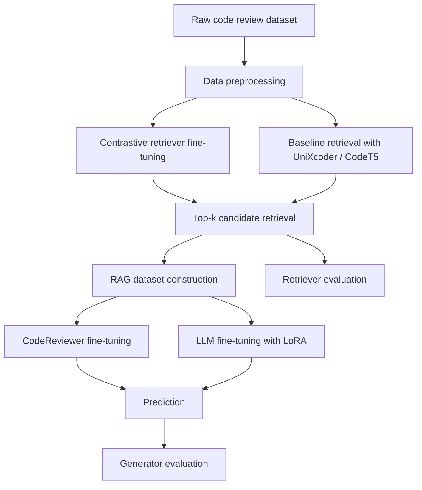

# CARES

> A retrieval-augmented code review comment generation framework with retriever training, generator fine-tuning, and evaluation utilities.

## Overview

CARES is a research-oriented repository for **automatic code review comment generation**. The project organizes the full workflow around a retrieval-augmented generation pipeline:

- retrieve historical review exemplars that are semantically close to the target code diff,
- inject retrieved code-review pairs as context,
- generate professional review comments with either a fine-tuned `CodeReviewer` model or an instruction-tuned LLM,
- evaluate both retriever quality and generation quality with standard text-generation metrics.

The repository currently contains the core scripts for:

- data preprocessing,
- baseline retrievers based on `UniXcoder` and `CodeT5`,
- contrastive fine-tuning for a retriever,
- RAG-style dataset construction,
- generator fine-tuning for `CodeReviewer` and LLM-based models,
- evaluation on overall and per-language settings.

## Key Features

- End-to-end workflow for retrieval-enhanced code review comment generation
- Multiple retriever options: `UniXcoder`, `CodeT5`, and contrastively fine-tuned retriever
- Multiple generator options: `microsoft/codereviewer` and LLM fine-tuning with `LLaMA-Factory`
- Support for JSONL-based datasets and RAG candidate files
- Built-in evaluation for retriever and generator outputs
- Per-language evaluation support through the `lang` field

## Method Pipeline



## Repository Structure

```text
.
├── data_process.py
├── evaluation.py
├── codeT5_retriever
│   ├── encode_code.py
│   └── generate_rag_candidates.py
├── unixcoder_retriever
│   ├── encode_code.py
│   └── generate_rag_candidates.py
├── retriever_finetuning
│   ├── contrastive_data_builder.py
│   ├── finetuning_pipeline.py
│   ├── get_rag_candidates.py
│   └── unixcoder_contrastive_trainer.py
└── generation_finetuning_with_RAG
    ├── finetuning_CodeReviewer
    │   ├── train_generator.py
    │   └── generation.py
    └── finetuning_LLM
        ├── alpaca_data_builder.py
        ├── train_generator.py
        ├── generation.py
        ├── training_args.yaml
        └── generate_args.yaml
```

## Environment Setup

The repository does not currently provide a pinned `requirements.txt`, so a clean Python environment is recommended.

### Recommended

- Python `3.10+`
- PyTorch with CUDA support for training/inference
- Git LFS or sufficient storage if you plan to manage large checkpoints locally

### Install Core Dependencies

```bash
pip install torch transformers tqdm numpy scikit-learn sentence-transformers nltk bert-score rouge-score evaluate faiss-cpu
```

### Install LLM Fine-Tuning Dependency

If you want to use the LLM fine-tuning pipeline:

```bash
pip install llamafactory
```

If you train on GPU, install the CUDA-compatible versions of PyTorch and FAISS according to your environment.

## Data Format

The project uses JSONL files, but **different modules currently expect slightly different field names**. Before running the pipeline, make sure your dataset format matches the target script.

### Format A: preprocessing / generation scripts

Commonly used fields:

- `diff`: code diff / patch content
- `msg`: review comment
- `lang`: optional programming language
- `new`: extracted new code version in some preprocessing scripts

Example:

```json
{"diff":"@@ -1,2 +1,2 @@\n-old_line\n+new_line","msg":"Consider handling the null case explicitly.","lang":"python"}
```

### Format B: retriever contrastive fine-tuning scripts

Expected by `retriever_finetuning/contrastive_data_builder.py`:

- `hunk`: code diff
- `comment`: review comment
- `lang`: programming language

Example:

```json
{"hunk":"@@ -10,3 +10,5 @@\n-if (x)\n+if (x != null)","comment":"Please add a null check before dereferencing.","lang":"java"}
```

## Quick Start

### 1. Preprocess raw data

Use `data_process.py` if your raw data contains `patch` and `msg` fields and you want to convert it into a simplified JSONL format.

```bash
python data_process.py
```

This script is intended to transform raw patch data into records containing fields such as `diff`, `new`, `msg`, and optionally `lang`.

### 2. Build baseline retrieval candidates

#### UniXcoder retriever

```bash
cd unixcoder_retriever
python encode_code.py
python generate_rag_candidates.py
```

#### CodeT5 retriever

```bash
cd codeT5_retriever
python encode_code.py
python generate_rag_candidates.py
```

These scripts generate top-k retrieved code/comment candidates that can be injected into downstream RAG generation.

### 3. Fine-tune the retriever

```bash
cd retriever_finetuning
python finetuning_pipeline.py
python get_rag_candidates.py 30
```

This stage:

- splits the dataset,
- builds triplet data for contrastive learning,
- fine-tunes a `UniXcoder`-based retriever,
- exports retrieval results for train/validation/test sets.

### 4. Build RAG training data for LLM generation

```bash
cd generation_finetuning_with_RAG/finetuning_LLM
python alpaca_data_builder.py
```

This converts raw diff/comment data and retrieved exemplars into Alpaca-style instruction tuning data.

### 5. Fine-tune the generator

#### Option A: CodeReviewer

```bash
cd generation_finetuning_with_RAG/finetuning_CodeReviewer
python train_generator.py
python generation.py
```

#### Option B: LLM with LLaMA-Factory

```bash
cd generation_finetuning_with_RAG/finetuning_LLM
python train_generator.py
python generation.py
```

The LLM pipeline uses `training_args.yaml` and `generate_args.yaml` for training and prediction configuration.

### 6. Evaluate outputs

```bash
python evaluation.py
```

The evaluation module supports:

- retriever evaluation,
- generator evaluation,
- per-language generator evaluation.

## Evaluation Metrics

### Retriever

- BLEU
- ROUGE-L
- BERTScore
- Semantic Recall at a BERTScore threshold

### Generator

- BERTScore-F1
- BLEU-4
- ROUGE-L

### Multi-language Evaluation

If your test file includes a `lang` field, `evaluation.py` can report results by programming language.

## Important Configuration Notes

Before running the scripts, please review and update hard-coded paths and placeholders in the repository.

### Paths that usually need to be customized

- `dataset_path`
- `dataset_base_path`
- `your_full_database.jsonl`
- `your_full_database_path`
- `your_output_path`
- model checkpoint paths inside generation scripts

### Files worth checking first

- `retriever_finetuning/finetuning_pipeline.py`
- `retriever_finetuning/get_rag_candidates.py`
- `generation_finetuning_with_RAG/finetuning_LLM/alpaca_data_builder.py`
- `generation_finetuning_with_RAG/finetuning_LLM/training_args.yaml`
- `generation_finetuning_with_RAG/finetuning_LLM/generate_args.yaml`
- `generation_finetuning_with_RAG/finetuning_CodeReviewer/generation.py`

### Practical advice

- Unify your dataset field names before starting a full experiment
- Keep train/validation/test file naming consistent across retriever and generator modules
- Verify that retrieved candidate files follow the expected format: every `top_k` lines correspond to one sample
- Double-check checkpoint and output directories before launching long-running jobs

## Suggested Reproduction Order

For a clean reproduction, the following order is recommended:

1. Prepare and normalize the dataset
2. Generate baseline or fine-tuned retriever outputs
3. Build RAG-formatted training data
4. Fine-tune a generator
5. Run inference on the test split
6. Evaluate retriever and generator outputs

## Current Scope

This repository currently focuses on **training and experimentation scripts**. It does not yet bundle:

- a release-ready command-line interface,
- a pinned dependency lockfile,
- public dataset files,
- packaged pretrained checkpoints.

That makes the repository especially suitable for research replication, method iteration, and internal experimentation.

## Citation

If this repository is associated with a paper or thesis, you can add a citation block here later.

```bibtex
@misc{cares,
  title={CARES},
  author={Anonymous},
  year={2026}
}
```

## License

Please add an explicit license file if you plan to open-source the repository publicly.

